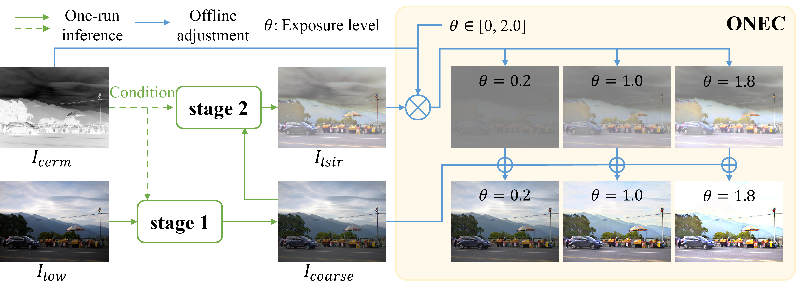
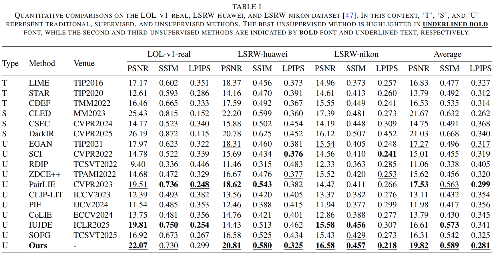
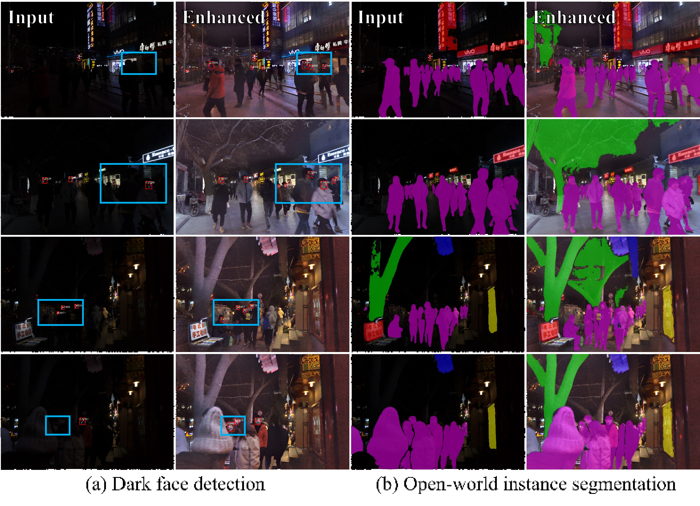

# TSECN (Two-stage Exposure-controllable Network for Low-light Degradation, Under Review)
#### News
- **Jun 17, 2025:**  Our work has been submitted and is under review.
- **Jun 19, 2025:**  We have released the results of compared methods and testing code.

> **Simplified abstract:** *This paper has proposed a staged framework for low-light image enhancement (LLIE) featuring a low-cost offline control strategy with natural transition effects. Extensive comparisons and ablations are conducted to demonstrate the efficiency of its designs. Eight benchmarks are included for comparisons, including LOL-v1-real, LSRW-huawei, LSRW-nikon, LIME, DICM, MEF, NPE, and VV. For the first three paired datasets, PSNR, SSIM, and LPIPS scores are measured. For the last five unpaired datasets, we employ three reference-free metrics, i.e. NIQE, ILNIQE, and BRISQUE.* 
>

  

---

## Installation

    python==3.8.20
    torch==1.11.0+cu113
    torchvision==0.12.0+cu113
    visdom==0.2.4
    ...

## Results of compared methods

We provide the shared link for results of compared methods.

Results across all datasets: [百度网盘](https://pan.baidu.com/s/1nV-cI2_-5oghIFqbKCUkdg?pwd=c5fk)

## Evaluation (WIP)

You can obtain the quantitative metrics of the experiments by running the following command：

    python xxx.py

## Results

  

  

  

  

## Citation
Our work is built upon the codebase of [EnlightenGAN](https://github.com/VITA-Group/EnlightenGAN) and [PairLIE](https://github.com/zhenqifu/PairLIE), and we sincerely thank them for their contribution.